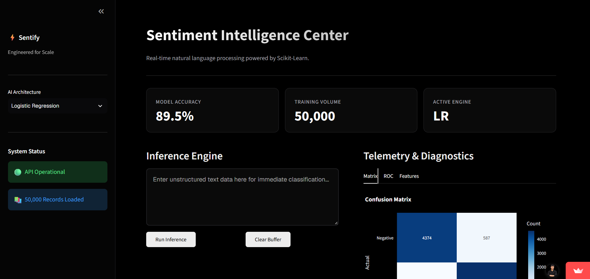

# ⚡ Sentify Pro: Enterprise Sentiment Intelligence

[](https://www.python.org/downloads/)
[](https://streamlit.io)
[](https://scikit-learn.org/)
[](https://opensource.org/licenses/MIT)

**Live Demo:** [https://husrocks-sentiment-analysis-app-nhufzq.streamlit.app/](https://husrocks-sentiment-analysis-app-nhufzq.streamlit.app/)



## 📌 Project Overview
**Sentify Pro** is a high-performance sentiment analysis engine engineered to classify unstructured text (like movie reviews) into **Positive** or **Negative** sentiments. Built entirely on a modular **Object-Oriented Programming (OOP)** architecture, it processes large-scale text data in milliseconds.

The system features a **custom-designed, fully responsive frontend** built on top of Streamlit. Unlike standard data apps, Sentify Pro utilizes a completely custom HTML/CSS layer to provide a stark, professional dark theme with distinct, highly optimized layouts for both Desktop and Mobile devices.

## 🚀 Key Technical Features
* **Modular OOP Architecture:** Enforces robust design patterns using Abstract Base Classes (`BaseMLModel`), allowing instant model swapping via Polymorphism.
* **Dual Inference Engines:** Seamlessly toggle between **Logistic Regression** and **Naive Bayes** classification algorithms in real-time.
* **Custom Responsive UI:** A premium, Vercel-inspired dark UI with custom CSS grids that automatically adapt between desktop (multi-column) and mobile (stacked) views.
* **Advanced Telemetry & Analytics:**
    * **Interactive Confusion Matrix:** Transparent Plotly heatmaps for error visualization.
    * **ROC Curve Analytics:** Measure model sensitivity and specificity thresholds.
    * **Feature Importance Mapping:** Explains the "why" behind decisions by highlighting the words carrying the most weight.

## 📂 System Architecture

The codebase is strictly separated into 4 distinct modular components:

| Module | Purpose | Description |
| :--- | :--- | :--- |
| `data_loader.py` | **ETL Pipeline** | Handles data ingestion, missing value mitigation, and TF-IDF text vectorization. |
| `models.py` | **ML Core** | Implements the `BaseMLModel` interface and concrete implementations (`LogRegModel`, `NaiveBayesModel`). |
| `evaluator.py` | **Diagnostics** | Calculates accuracy metrics and generates transparent Plotly visualization figures. |
| `app.py` | **Presentation Layer** | The main Streamlit entry point containing the custom responsive CSS/HTML UI overrides. |

## 🛠️ Installation & Setup

### 1. Clone the Repository
```bash
git clone https://github.com/Husrocks/Sentiment-Analysis.git
cd Sentiment-Analysis
```

### 2. Install Dependencies
```bash
pip install -r requirements.txt
```

### 3. Run the Dashboard
```bash
streamlit run app.py
```
> **Note:** Ensure you have the `reviews.csv` (IMDB dataset) in the root directory before launching the app.
